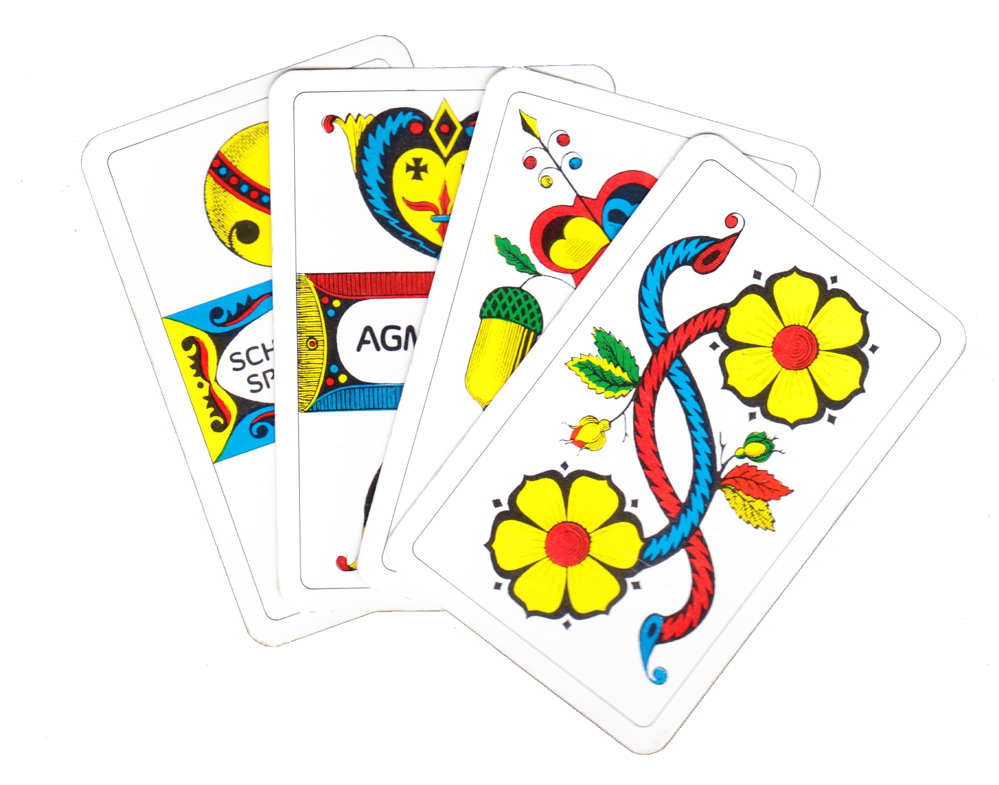

# Capstone Project
# Jass Summarizer

## Information
There are two ways to explore the Jassummarizer project. 
1. The jupiter notebook [the_story](the_story.ipynb) holds all steps in one notebook from start to the end. 
2. The jupyter notebook [project proposal-reto-loser](project-proposal-reto-loser.ipynb) holds in general the proposal and goes further through all chapters that have to be covered. Within this notebook the following Subnotebooks are linked:
* [02_DataPreparation_01 notebook](02_DataPreparation_01.ipynb) - Data extraction from movies & statistics
* [02_DataPreparation_02 notebook](02_DataPreparation_02.ipynb) - Data extraction from webcam 
* [02_DataPreparation_03 notebook](02_DataPreparation_03.ipynb) - Synthetic Data generation  & statistics 
* [02_DataPreparation_04 notebook](02_DataPreparation_04.ipynb) - Data preparation & feature engineering
* [03_ExplorationDataAnalysis_01 notebook](03_ExplorationDataAnalysis_01.ipynb)  
  - Exploration on Color Separation & Clustering
  - Combined Color Histogram over all Images (min, max, avg)
* [04_Machine_learning_01](04_Machine_learning_01.ipynb)  
  - runs the 9 different convolutional neural network models
* [04_Machine_learning_02](04_Machine_learning_02.ipynb)  
  - uses a pretrained model "mobilenet" with Random-Forest Classifier
* [04_Machine_learning_03](04_Machine_learning_03.ipynb)  
  - Does Hyperparameter tuning on the previous pretrained model "mobilenet" with Random-Forest Classifier
* [05_Frontend](05_Frontend.ipynb)  
  - is the interactive notebook which only runs with a webcam installed
  - offers webcam calibration and threshold justification
  - offers the interface to choose the jassmode that is currently playing and does the calculation on the dropped cards.
> Note:  The background scanned by the webcam should appear as full black. Personally I used a black A3 paper.

---
> Author: Reto Loser  
> Date: 24.03.2021  
>
> Dependencies: [OpenCV 4.5.1](https://github.com/opencv/opencv/releases) ([Doc](https://docs.opencv.org/4.5.1/d6/d00/tutorial_py_root.html))  
(pip install opencv-contrib-python)  
> initial revision: 27.01.2021 (v0.5)  
> update: 11.02.2021 (v1.0)  
> update: 11.03.2021 (v1.1)  
> latest update: 24.03.2001 (v1.2)

---
**Configuration history**  
exts-ml.yml  
pip install opencv-contrib-python  
pip install keras==2.0.8  
pip install scikit-image  
pip install numpy==1.16.1  ( before 1.15.4)  

---

## Additional References I have found very useful
### A very good place to learn about colors
* https://en.wikipedia.org/wiki/HSL_and_HSV
* http://mkweb.bcgsc.ca/color-summarizer

### Nice explanation for image manipulations
* https://setosa.io/ev/image-kernels/
  * sharpening
  * bluring
  * emboss
  * outline
  * different [sobel-operator](https://de.wikipedia.org/wiki/Sobel-Operator)

> Example:  
> kernel = np.array([  
> [ 0,-1, 0],  
> [-1, 5,-1],  
> [ 0,-1, 0]   ])   
> img = cv2.filter2D(image, -1, kernel)  
> cv2.imshow("Sharpening",img)  

